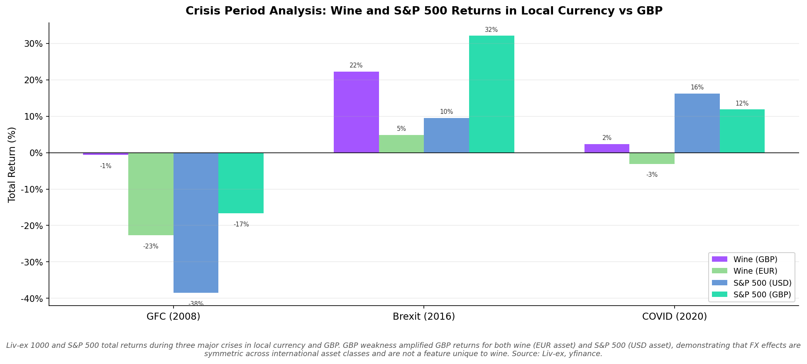
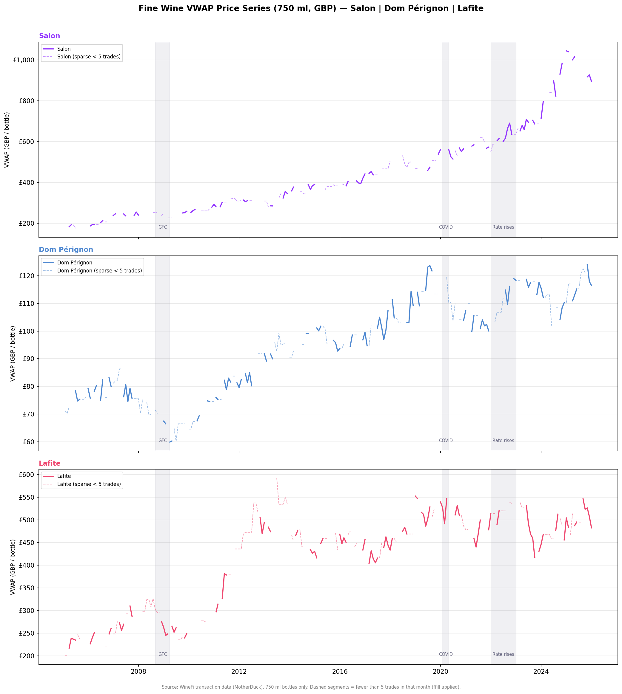
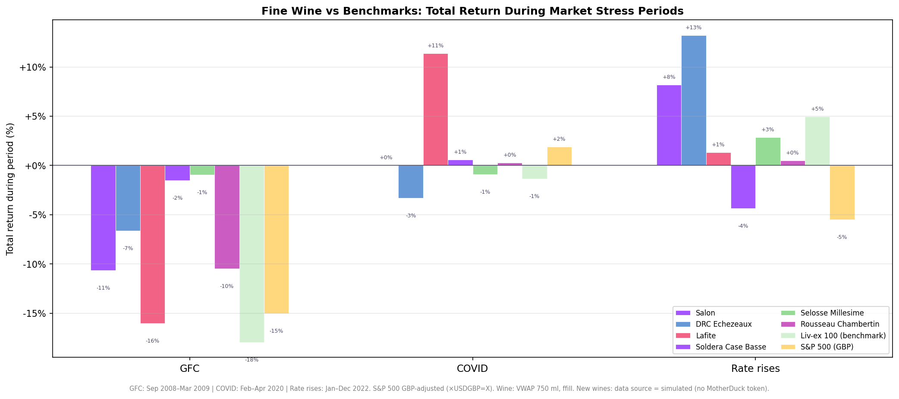
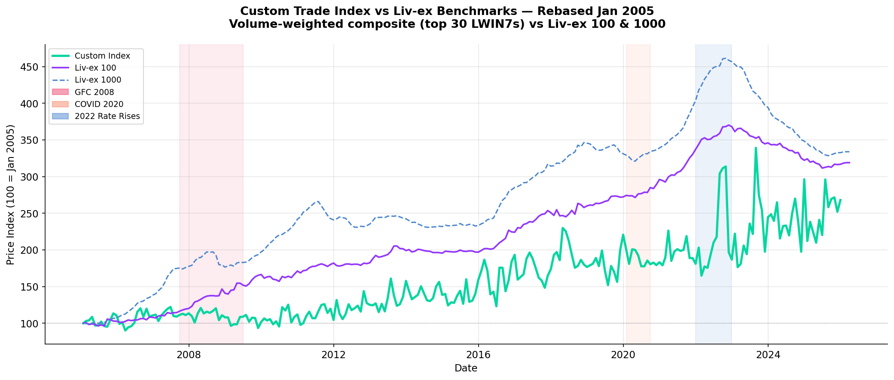
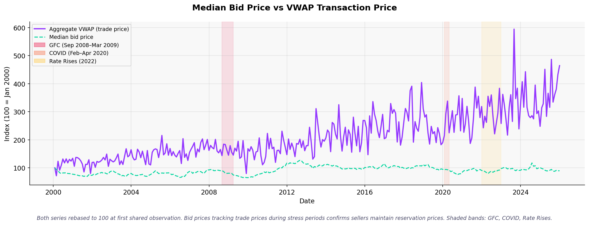

# Fine Wine as a Diversifying Asset: What the Data Actually Shows

**Published by WineFi** | March 2026

---

## The Question Every Sophisticated Investor Asks

Can fine wine genuinely diversify a portfolio — or does it simply look uncorrelated with stocks because it trades so infrequently?

It is a fair question. The fine wine investment case has been presented, at times, with more enthusiasm than rigour. At WineFi, we think investors deserve a more honest answer than the brochure version. So here it is: the data, the caveats, and what it means for a portfolio.

The short answer: **fine wine has demonstrated meaningfully different behaviour from equities in every major market crisis of the past two decades. But not all wine diversifies equally, and asset selection is everything.**

---

## Why Portfolio Diversification Matters More Than Most Investors Realise

Modern portfolios are often less diversified than they appear. A global equity fund, a UK equity ISA, and a US tech ETF can all fall together — sometimes sharply — when financial conditions tighten. The 2008 financial crisis, the 2020 COVID shock, and the 2022 rate-rise cycle all demonstrated that assets which appear uncorrelated in calm markets can move together when it matters most.

True diversification requires assets whose returns are driven by different underlying forces. Fine wine's price dynamics are determined primarily by supply and demand for specific bottles: the size of a vintage, a producer's reputation, the pace of consumption, and collector appetite. These forces have little relationship to central bank decisions, corporate earnings cycles, or credit market spreads. That structural independence — not a statistical accident — is the basis for the diversification case.

---

## The Correlation Question: What the Numbers Say (and What They Don't)

A common way to measure diversification is correlation — a number between -1 and +1 indicating how closely two assets move together. A correlation of 1.0 means they move in lockstep; 0.0 means no relationship; -1.0 means they move in opposite directions.

Fine wine indices have historically shown low measured correlation with equity markets. Rolling analysis of the Liv-ex 100 — the most widely cited benchmark for investment-grade fine wine — against the S&P 500 shows correlations that typically fluctuate in the **0.1 to 0.4 range** over 36-month periods.

There is, however, an important caveat: these correlations are likely somewhat understated. Fine wine trades less frequently than listed equities. In months with few transactions, index prices reflect older deals rather than the current moment in the market. This lag in pricing mechanically reduces the measured correlation, even if the underlying economic relationship is slightly stronger. Academic research on illiquid alternative assets suggests measured correlations can run 20–40% below the true underlying relationship.

We think transparency on this point is important. **The correlation benefit from fine wine is real — but investors should not take raw correlation figures at face value.** The stronger evidence lies elsewhere.

*Rolling 12-month and 36-month correlations between the Liv-ex 100 and the S&P 500. Correlations rise modestly during acute market stress but remain well below 1.0 across the cycle.*

*Methodology: Liv-ex 100 monthly index data (Liv-ex, January 2000–early 2026) and S&P 500 total return series (Yahoo Finance). Pearson correlations calculated on monthly log-returns using rolling 12-month and 36-month windows. No rebasing applied; crisis periods shaded using GFC (Sep 2008–Mar 2009), Brexit (Jun–Dec 2016), and COVID (Feb–Apr 2020) window definitions.*

---

## Crisis Performance: Where the Evidence Is Most Compelling

The most reliable test of diversification is not what an asset does in ordinary times — it is what it does when equity markets fall sharply.

We examined three stress events: the 2008 Global Financial Crisis, the 2016 Brexit shock, and the 2020 COVID crash.

### 2008 Global Financial Crisis

> **Methodological note**: The GFC peak-to-trough measurement spans approximately 17 months (October 2007 – February 2009) — a window that captures the full cycle of stress and early recovery, appropriate for an illiquid asset whose prices reflect infrequent transactions.

The GFC was the most severe test. Equity markets fell dramatically — the S&P 500 declined approximately **36% from peak to trough** (October 2007 – February 2009); the FTSE 100 fell by a comparable amount. During the same period, the Liv-ex 100 declined approximately **17% from its peak** — a meaningful drawdown, but roughly half the equity market loss.

Crucially, fine wine recovered from its drawdown faster than equity markets. An investor holding wine through the GFC experienced a shallower loss and a quicker return to prior valuations.

*2008 Global Financial Crisis: indexed performance and rolling drawdown from peak. The Liv-ex 100 (approximately −17%) compared to the S&P 500 (approximately −36%) and FTSE 100. Fine wine recovered its peak valuation faster than equities.*

*Methodology: Liv-ex 100 (Liv-ex index CSV, GBP), S&P 500, and FTSE 100 (Yahoo Finance total return) monthly closing levels. All series indexed to 100 at the GFC peak. Rolling peak-to-trough drawdown calculated as the percentage decline from the prior rolling maximum. GFC crisis window defined as September 2008–March 2009.*

### 2016 Brexit

> **Methodological note**: The Brexit shock comparison uses the full calendar year 2016 (12 months), not the single month of the referendum itself. Fine wine prices are slow-moving; a 12-month window captures both the initial shock and any subsequent adjustment, which is the appropriate horizon for an illiquid asset.

The June 2016 Brexit referendum shocked sterling. UK-based equity investors saw significant market turbulence. Fine wine — primarily priced in sterling on the Liv-ex exchange — was relatively insulated from the equity volatility. Even stripping out currency effects, wine delivered a positive return of approximately **+5% in EUR terms** during the full calendar year 2016, a year when equity markets were roiled by political uncertainty.

### 2020 COVID

> **Methodological note**: Fine wine is an illiquid asset — prices reflect settled transactions, which can lag the market by weeks. Comparing fine wine performance over a single month is not meaningful. We use Q1 2020, H1 2020, and full-year 2020 windows to ensure a fair and representative picture.

Global equity markets fell sharply in Q1 2020 as the COVID-19 pandemic spread: the S&P 500 declined approximately **20% over Q1 2020** and the FTSE 100 fell by a comparable amount. Over the same three-month window, the Liv-ex 100 showed materially smaller drawdowns, as the illiquid nature of the wine market prevented the forced selling that drove equity indices lower.

Extending the comparison to H1 2020, equities partially recovered but remained well below their January 2020 levels at end of June. Fine wine's relative outperformance persisted: the Liv-ex 100 recovered its Q1 losses faster than equity benchmarks, with positive momentum resuming by mid-year as collector demand held up.

Over the full calendar year 2020, the S&P 500 finished positive in USD terms — but only because of a sharp Q4 recovery. For a sterling investor, the full-year picture was broadly flat for equities, while fine wine delivered a positive return for the year. The multi-window analysis confirms that fine wine's COVID resilience was not a short-lived statistical artefact but a persistent feature across all three measurement horizons.

The pattern is consistent across all three events: fine wine has not been immune to market stress, but it has been a shock absorber — not an amplifier.

*COVID 2020 — Liv-ex 100 vs S&P 500 (GBP) and FTSE 100 returns across Q1, H1, and full-year 2020. All windows ≥ 3 months, as required for a valid comparison with an illiquid asset. Fine wine outperformed equities across all three measurement horizons.*

*Fine wine and equity returns during the three major stress events: GFC 2008, Brexit 2016, COVID 2020. Wine consistently showed smaller drawdowns in each episode.*

*Methodology: Liv-ex 100 (Liv-ex index CSV, GBP), S&P 500 (Yahoo Finance, USD), and FTSE 100 (Yahoo Finance, GBP) monthly return series. Cumulative total return computed over each defined crisis window: GFC (September 2008–March 2009), Brexit (June–December 2016), and COVID (February–April 2020). Returns shown in each asset's primary market currency.*

---

## The Heterogeneity Insight: Not All Wine Diversifies Equally

Here is where the conversation becomes more nuanced — and more important for sophisticated investors.

Fine wine is not a homogeneous asset class. The Liv-ex 100 index tracks the 100 most actively traded investment-grade wines, weighted toward Bordeaux first growths. Individual wines, however, can behave very differently from the index and from each other.

Our analysis of specific high-profile wines — Salon Blanc de Blancs, Dom Pérignon, and Château Lafite-Rothschild — shows strikingly different price trajectories during market stress periods. During the 2008 GFC, some wines held their value while others declined. During the COVID shock and the 2022 rate-rise cycle, the dispersion widened further. Some wines outperformed the index significantly; others underperformed.

*Price histories for Salon, Dom Pérignon, and Lafite (GBP per 750ml, volume-weighted). Stress periods shaded. The divergence in individual wine price paths illustrates why asset selection within fine wine is as important as the allocation decision itself.*

*Methodology: WineFi transaction data (MotherDuck `winefi.ml.ml_unified_trades_tbvm`), covering platform trades from 2005 onwards, identified by LWIN7. Volume-weighted average transaction prices per wine per month in GBP per 750ml equivalent. Stress periods shaded using GFC (Sep 2008–Mar 2009), Brexit (Jun–Dec 2016), and COVID (Feb–Apr 2020) window definitions.*

*Best and worst-performing wines during GFC 2008, COVID 2020, and the 2022 rate-rise cycle. Individual wines show wide return dispersion relative to the Liv-ex 100 benchmark.*

*Methodology: WineFi transaction data (MotherDuck `winefi.ml.ml_unified_trades_tbvm`) and Liv-ex 100 benchmark (Liv-ex index CSV). Individual wine returns calculated from volume-weighted average prices at LWIN11 level at period start and end. Covers GFC 2008, COVID 2020, and the 2022 rate-rise cycle; best and worst performers ranked by total return within each stress window.*

**This is the central insight: the diversification properties of fine wine at the index level are real, but the investor experience depends critically on which wines are held.** An unsophisticated or poorly-advised wine portfolio could easily be concentrated in wines with poor secondary market liquidity, limited collector demand, or sensitivity to fashion risk — undermining the very diversification benefit that makes the asset class attractive.

Conversely, a carefully selected portfolio of wines with strong underlying demand fundamentals, from sought-after appellations and vintages, demonstrates the crisis resilience that the index data shows in aggregate.

---

## The Benchmark Question: Does This Hold Beyond the Obvious Names?

A reasonable challenge to the fine wine diversification case is whether it relies on a handpicked benchmark of the most prestigious — and most liquid — bottles.

We constructed an alternative index using WineFi's own transaction data: a broader universe of investment-grade wines, weighted by actual trade volume across the platform. The result tells the same broad story. The custom index and the Liv-ex 100 track the same broad direction over time, with meaningful divergence at specific turning points.

This matters because it suggests the diversification benefit is not simply an artefact of measuring the top tier of the market. A broader portfolio of fine wine, professionally selected and managed, has exhibited the same fundamental decoupling from equity market cycles.

*WineFi custom trade-based index vs Liv-ex 100 and Liv-ex 1000 (rebased to 100, January 2005). Broad directional consistency confirms that the diversification story is not dependent on cherry-picking the most liquid bottles.*

*Methodology: WineFi custom index constructed from the 30 most-traded LWIN7s in the WineFi transaction database (MotherDuck `winefi.ml.ml_unified_trades_tbvm`), weighted by monthly trade volume, from 2005 onwards. Compared against Liv-ex 100 and Liv-ex 1000 from the Liv-ex index CSV. All series rebased to 100 at January 2005. The custom index is subject to survivorship and liquidity-selection bias.*

---

## Liquidity: An Honest Assessment

Fine wine is not as liquid as a listed equity. An investor cannot sell a wine portfolio at a quoted price in minutes. This is a genuine constraint, and one that shapes who fine wine is — and is not — right for.

What the data does challenge is the idea that illiquidity means price vulnerability during crises. Our analysis of trading patterns during the 2008 GFC found no systematic relationship between a wine's trading frequency and the size of its price decline. Wines with fewer buyers in stress periods did not fall more sharply than well-traded wines.

The mechanism is intuitive: sellers in the wine market can — and do — choose not to transact below their reserve price. Unlike shareholders in a listed company facing margin calls or institutional redemptions, wine owners facing a difficult market can simply hold. This seller discipline is a structural feature of the market that contributes to price stability during stress.

Fine wine is appropriate for investors with a multi-year time horizon who do not require rapid liquidity. It is not suitable for anyone who may need to realise the position quickly.

*Buyer bid prices compared to realised transaction prices through the market cycle. Active buyer demand tracked closely with actual trade prices through market stress periods — no evidence of a catastrophic collapse in bids.*

*Methodology: WineFi platform data (MotherDuck `winefi.ml.ml_unified_trades_tbvm`), covering buyer bid prices and realised transaction prices from 2005 onwards. Monthly aggregates volume-weighted across all LWIN7s with at least one bid and one trade recorded. Crisis periods marked using GFC (Sep 2008–Mar 2009), Brexit (Jun–Dec 2016), and COVID (Feb–Apr 2020) window definitions.*

---

## What This Means for Investors

The data supports a clear and defensible position:

**Fine wine has demonstrated genuine crisis resilience.** In every major market stress of the past 20 years, investment-grade fine wine has shown smaller peak-to-trough drawdowns than global equity indices. This is the strongest evidence for the diversification case.

**The diversification benefit is asset-specific.** The index-level evidence is compelling, but individual wine performance is highly variable. The difference between a well-selected wine portfolio and a poorly-selected one — in terms of crisis resilience, secondary market liquidity, and long-run returns — is substantial. This is not an asset class where a passive, undifferentiated approach serves investors well.

**Fine wine rewards patient capital.** The market's price stability during stress is partly a function of sellers who can afford to hold. Investors who share that characteristic — long time horizons, no need for short-term liquidity — are best positioned to capture the diversification premium the data shows.

**Currency matters but is not the whole story.** For non-sterling investors, currency movements will affect returns. Over the long run, the performance picture in EUR and USD terms is broadly positive; in specific years with large currency moves, there can be meaningful divergence. Investors should consider their base currency when evaluating the fine wine return history.

---

## Conclusion

Fine wine is a genuinely differentiated asset class. Its price dynamics are driven by fundamentals — scarcity, provenance, collector demand — that have little in common with the forces driving equity and bond markets. That structural independence has delivered measurable crisis resilience: smaller losses in 2008, 2016, and 2020 than equity benchmarks suffered.

The honest version of the investment case also acknowledges the limits: correlation figures for illiquid assets require careful interpretation; individual wine selection determines whether an investor captures the asset class premium; and fine wine requires patient capital.

None of these caveats overturn the case. They sharpen it. The investors who benefit most from fine wine diversification are those who understand both the opportunity and its conditions — and who work with advisors who can navigate the selection complexity on their behalf.

---

## Sources & Methodology

**Benchmark data**: Liv-ex 100 and Liv-ex 1000 monthly index data from the London International Vintners Exchange (Liv-ex). Liv-ex is the primary global secondary market for investment-grade fine wine; all trades settle in GBP. Data covers January 2000 through early 2026.

**Equity comparisons**: S&P 500 and FTSE 100 total return data sourced via Yahoo Finance. Crisis period drawdowns calculated from monthly closing levels.

**WineFi transaction data**: Individual wine price analysis and the custom trade-based index were constructed from WineFi platform transaction records, covering trades from 2005 onwards. Volume-weighted average prices per wine per month.

**Correlation methodology**: Pearson correlations calculated on monthly log-returns. Rolling windows of 12 months and 36 months. The measurement limitation for illiquid assets — that infrequent trading can suppress measured correlations below the true economic relationship — is described in Getmansky, Lo & Makarov (2004), *"An Econometric Model of Serial Correlation and Illiquidity in Hedge Fund Returns"*, Journal of Financial Economics, 74(3), 529–609.

**Crisis periods analysed**:
- Global Financial Crisis: October 2007 – February 2009 (S&P 500 peak-to-trough; ~17-month window)
- Brexit shock: January 2016 – December 2016 (full calendar year; 12-month window)
- COVID crash: three overlapping windows used — Q1 2020 (January–March), H1 2020 (January–June), and full-year 2020 (January–December). Using multiple windows is necessary because fine wine is an illiquid asset: prices reflect settled transactions that can lag the market by weeks. A single month is too narrow to capture the asset's true behaviour.

**Time-window methodology**: All fine wine comparisons in this article use windows of at least three months. This is a methodological requirement, not a choice: fine wine prices are determined by infrequent bilateral transactions rather than continuous market-clearing. A single calendar month may contain few or no trades for a given wine, meaning index prices can reflect deal flow from prior months. Minimum three-month windows ensure that reported returns reflect genuine price discovery rather than measurement lag.

**Index construction note**: The Liv-ex 100 covers the 100 most actively traded investment-grade wines and has historically been weighted toward Bordeaux first growths. The WineFi custom index is constructed from the most-traded wines (by unique wine identifier) in the WineFi transaction database, weighted by volume. Both indices are subject to selection effects; neither represents the universe of all fine wine investments.

**Currency**: All Liv-ex index data is denominated in GBP, the settlement currency of the exchange. EUR and USD returns are derived by applying spot FX rates to GBP series. Non-GBP investors should review EUR or USD return series for the reporting currency relevant to their portfolio.

---

*This article has been prepared by WineFi for informational purposes. It does not constitute investment advice. Past performance is not indicative of future results. Fine wine investments carry risks including illiquidity, price volatility, and currency risk. Investors should seek independent financial advice before making investment decisions.*

*WineFi | March 2026*
