# Fine Wine as a Structural Portfolio Diversifier

*WineFi Research | March 2026*

---

> *Fine wine should not be viewed as a perfect hedge. But for investors seeking genuine diversification — assets that behave differently from equities and bonds across a full market cycle — a carefully selected fine wine portfolio can play a meaningful structural role.*

---

## Introduction

The search for diversification is one of the oldest challenges in portfolio management. The goal is straightforward: hold assets that do not all move together, so that a fall in one is cushioned by stability or gains in another. In practice, however, finding such assets is harder than it appears. Most conventional assets — equities across geographies, corporate bonds, commodities — show elevated correlation during the very market downturns when diversification matters most.

Fine wine occupies an unusual position in this context. It is driven by a distinct set of economic, agricultural, and cultural forces. Its pricing is grounded in scarcity, vintage quality, producer reputation, and the preferences of a global collector base — dynamics that have little to do with interest rate cycles or corporate earnings. At the same time, fine wine is not fully insulated from financial conditions: the wealth effect, money supply, and global risk appetite all exert real influence on demand.

This article sets out WineFi's position on fine wine as a diversifier. It draws on data from the principal fine wine market indices and examines the evidence across multiple market cycles. It also addresses a number of legitimate concerns — about index construction, currency effects, and liquidity — that any serious investor should weigh before allocating to the asset class.

---

## Why Fine Wine May Behave Differently

Before examining the data, it is worth understanding *why* fine wine might exhibit different return patterns to conventional assets. There are several structural reasons.

**Supply constraints are vintage-specific and weather-driven.** The volume of any given wine is fixed at harvest. Exceptional vintages in short supply — whether from Burgundy, Champagne, or elsewhere — carry a scarcity premium that does not erode with monetary policy. Climate variation creates genuine supply shocks that are orthogonal to financial markets.

**Demand has idiosyncratic drivers.** Consumer taste, cultural trends, the emergence of new markets, and shifts in producer prestige all influence prices in ways that diverge from equity market cycles. The surge in Asian demand for top Bordeaux châteaux during the late 2000s, for example, was driven by factors entirely disconnected from the contemporaneous financial crisis.

**The asset is physically consumed.** Over time, bottles are drunk. This progressive reduction in supply of older vintages provides a floor to price deterioration that purely financial assets do not share.

**Pricing incorporates information slowly.** Fine wine trades infrequently. Prices are anchored to prior transactions and updated as trades clear. This means that the full impact of a macroeconomic shock may take months to be fully reflected — a feature that has implications for how we interpret short-term correlation data (discussed below).

These characteristics do not guarantee low correlation with financial markets. They explain why, structurally, such an outcome is plausible.

---

## What the Data Shows

### Static Correlations: A Starting Point, Not the Full Picture

The most common way to present wine's diversification case is a correlation matrix comparing monthly returns across asset classes. The picture is immediately striking.

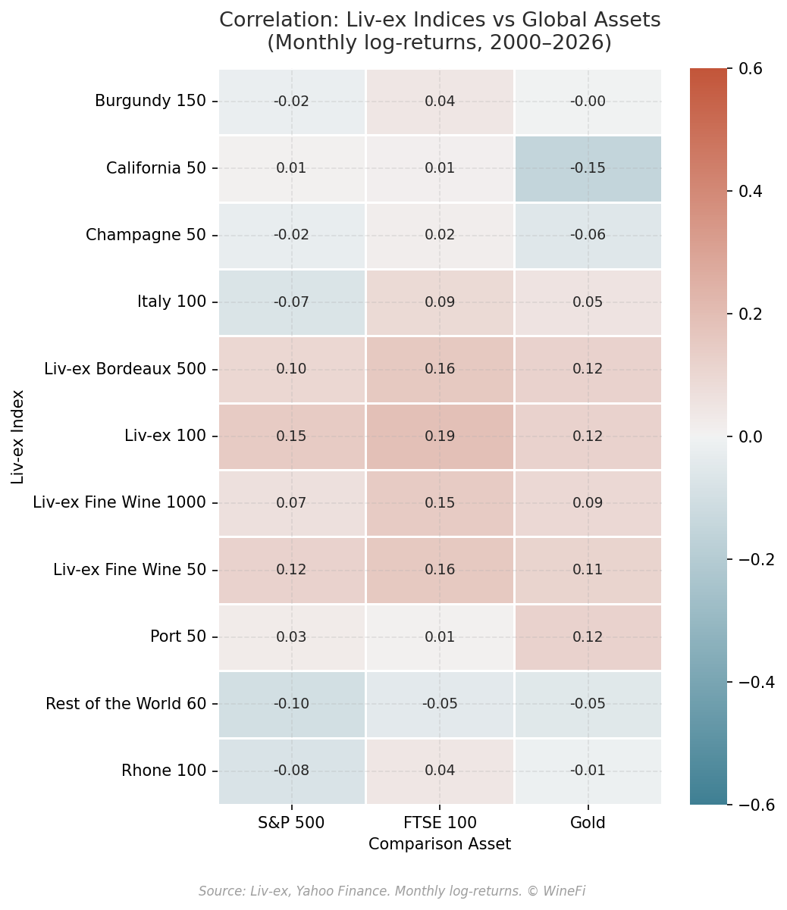

*Figure 1: Static correlation of monthly returns — fine wine versus global equities, bonds, gold, and commodities. Sources: Liv-ex, Bloomberg. Data from 2002 to 2025.*

Fine wine has historically shown low static correlation with equities, bonds, and most commodity indices. The numbers are compelling — but they require careful interpretation.

The low figures partly reflect a genuine economic reality, and partly reflect a measurement artefact. Fine wine prices are appraised rather than continuously traded. When trading is thin, prior prices anchor current valuations, introducing a smoothing effect that can make wine appear less volatile — and less correlated with other assets — than the underlying economic exposure actually warrants. Volatility is likely understated; diversification benefits, taken at face value, may be somewhat overstated.

This is an important caveat, and one we do not shy away from. It means the static correlation matrix, while useful as an initial framing, should not be the sole basis for any investment decision.

### Rolling Correlations: A More Honest View

Rolling correlations — calculated over moving one-, two-, and three-year windows — provide a more realistic picture. Rather than averaging the relationship across an entire history into a single number, rolling analysis shows how the relationship between assets changes over time. Crucially, it reveals whether diversification persists during the market conditions when it matters most.

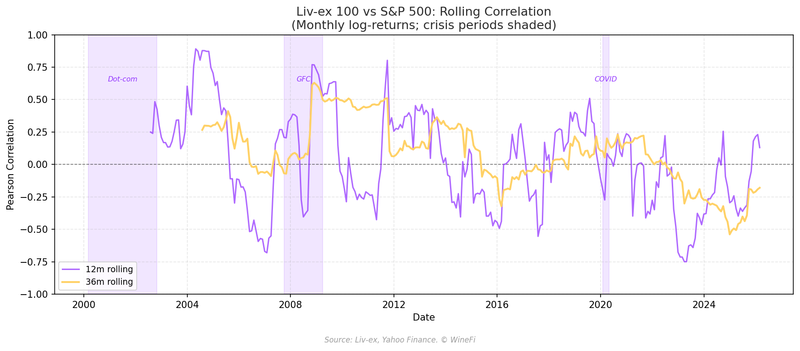

*Figure 2: One-year and two-year rolling correlation between fine wine and the S&P 500, FTSE 100, and other major equity markets. Sources: Liv-ex, Bloomberg.*

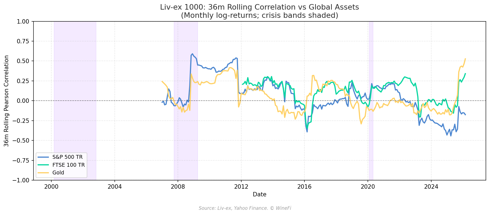

*Figure 3: Three-year rolling correlation — fine wine versus equities, gold, bonds, and commodities. The broader fine wine index incorporating approximately 1,000 wines is used here. Sources: Liv-ex, Bloomberg.*

Several observations stand out.

First, fine wine's correlation with equities is low over most of the period covered, but it is not zero and it is not stable. There are periods — notably around the 2008 financial crisis — when correlation rises, peaking briefly above 0.5 on a three-year rolling basis. This reflects genuine sensitivity to macro conditions during acute systemic stress.

Second, for context: the rolling correlation between major equity markets (S&P 500, Nikkei 225, Hang Seng) and between equities and corporate bonds typically hovers around or above 0.5 for extended periods. Fine wine's relationship is meaningfully different from these conventional asset pairs — not perfect, but genuinely lower and more variable.

Third, the correlation is time-varying, not persistent. This matters because it means fine wine does not consistently move with equities, even if it sometimes does. A structural diversifier need not be perfectly uncorrelated; it needs to reduce portfolio volatility on balance, across a full cycle.

---

## Resilience During Market Downturns

The most direct test of a diversifier is its behaviour when equities are under severe pressure. We examine three periods.

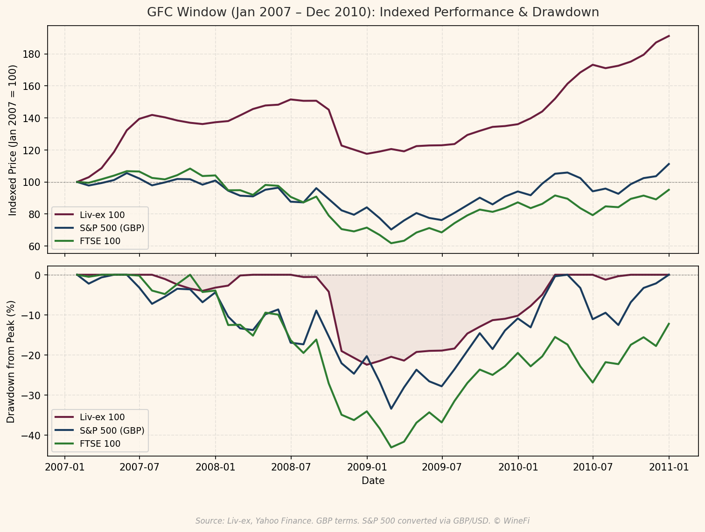

*Figure 4: Cumulative drawdown from peak — fine wine versus the S&P 500 during the 2008–2009 global financial crisis. Sources: Liv-ex, Bloomberg.*

**The 2008 Global Financial Crisis (September 2008 – February 2009).** The S&P 500 fell approximately 36% from its pre-crisis peak to its trough. The Liv-ex 100 fine wine index fell approximately 17% over the same period — a significantly shallower drawdown. More striking still: fine wine had recovered to its prior peak by early 2010. The S&P 500 did not recover to its 2007 high until 2013.

This is not simply an index construction artefact. The period captured active trading at market prices, including substantial institutional flows. The divergence in drawdown depth and recovery speed reflects a genuine difference in the economic forces acting on each asset class.

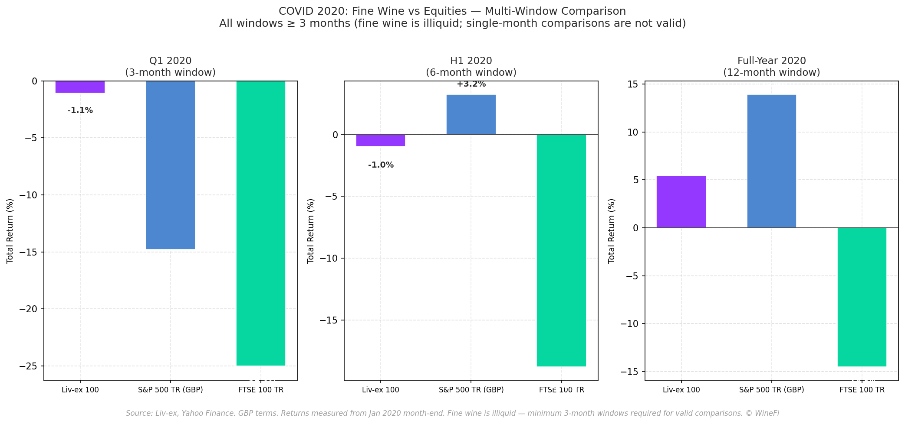

*Figure 5: Fine wine versus global equities around the COVID-19 market shock (January–April 2020). Sources: Liv-ex, Bloomberg.*

**The COVID Shock (January – March 2020).** The S&P 500 fell approximately 21% from peak to trough in this period. The Liv-ex 100 fell less than 1%. The brevity of the equity sell-off before stimulus intervention means we cannot place full weight on this episode — a more sustained downturn might have drawn more substantial response from fine wine prices. But the contrast in immediate market response is notable.

**The 2022 Rate-Driven Sell-off (December 2021 – September 2022).** As central banks tightened aggressively, the S&P 500 fell approximately 24% and gold fell approximately 9%. Over the same period, the Liv-ex 100 rose approximately 9%, driven by continued momentum in the fine wine bull market following COVID stimulus. This represents a period of genuine negative correlation between fine wine and equities — exactly the kind of performance that makes a structural case for allocation.

The picture is not uniformly positive. Fine wine entered a correction from 2023 as a supply glut worked through the market — while equities rallied. A complete assessment of fine wine's diversification characteristics must include this too. The asset does not move inversely to equities by design; it moves independently of them, driven by its own supply and demand dynamics. Over time, this independence provides structural diversification benefits, without requiring any particular directional relationship.

---

## The Importance of Selection: Fine Wine Is Not Homogeneous

One of the most important — and most frequently overlooked — aspects of fine wine as an asset class is its internal heterogeneity. Fine wine is not a single market. It is a collection of thousands of individual wines from dozens of regions and producers, each with distinct risk and return characteristics.

This heterogeneity is quantitatively significant. On a quarterly basis, approximately 20–30% of investment-grade wines typically appreciate in price, while 20–30% decline, and the remainder are broadly flat. The distribution of outcomes across individual wines is wide, even when aggregate indices are moving in one direction.

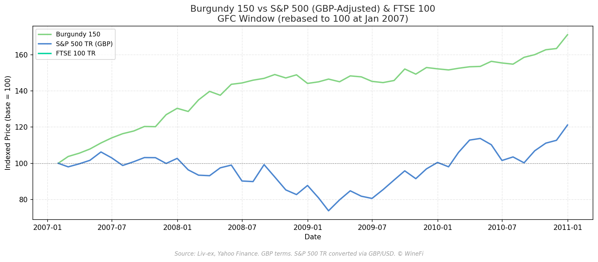

*Figure 6: Rolling correlation — the Burgundy 150 index versus S&P 500 and FTSE 100, with comparison to the broader Liv-ex 100. Sources: Liv-ex, Bloomberg.*

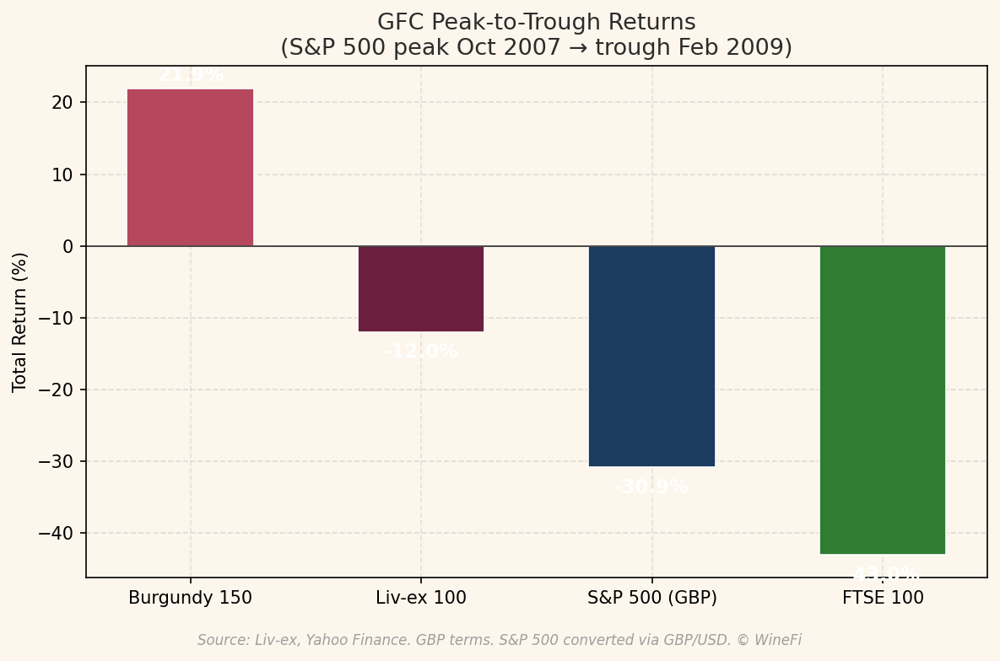

*Figure 7: Comparative performance — Burgundy 150 versus major equity indices during the 2008 global financial crisis. Sources: Liv-ex, Bloomberg.*

The Burgundy 150 index — tracking the 150 most frequently traded wines from Burgundy — has historically shown lower correlation with equities than the broader Liv-ex 100. This reflects the specific characteristics of the region: limited production volumes, exceptional global demand, and a collector base whose purchasing decisions are less sensitive to short-term financial market sentiment.

The broader Liv-ex Fine Wine 1000 index, which covers approximately ten times as many wines as the Liv-ex 100, also shows a different — and in many periods, more resilient — profile than the headline index alone.

This raises a critical point about index construction and benchmark selection. Any aggregate fine wine index reflects the wines it contains, and different aggregation choices yield meaningfully different results. An index heavy with highly liquid, widely traded Bordeaux wines will exhibit different behaviour from one weighted towards scarcer Burgundy or aged Champagne. This is not a problem unique to fine wine — but it is unusually pronounced here, and it matters for how investors evaluate the asset class.

The corollary is that active portfolio management is particularly important in fine wine. The diversification benefits available in the asset class are not uniformly distributed. Selection — both of regions and individual wines, and critically the prices at which they are purchased — determines whether a fine wine allocation achieves genuine diversification or merely replicates a cyclical luxury exposure.

---

## The Currency Dimension: Transparency and Context

One legitimate challenge to fine wine's diversification narrative concerns currency. Fine wine is produced predominantly in Europe; the leading secondary market trades in London; and the principal market indices are denominated in sterling. Wines themselves are largely priced in euros at source.

This creates an embedded currency dimension in any return calculation. When sterling weakens against the euro — as it did sharply after the Brexit referendum in 2016 and during several periods of financial stress — fine wine indices quoted in sterling will reflect that depreciation in addition to underlying wine price movements. The 2016 figures illustrate this clearly: the Liv-ex 1000 rose approximately 22% in sterling terms that year, but only approximately 5% measured in euros — a gap attributable almost entirely to sterling's depreciation.

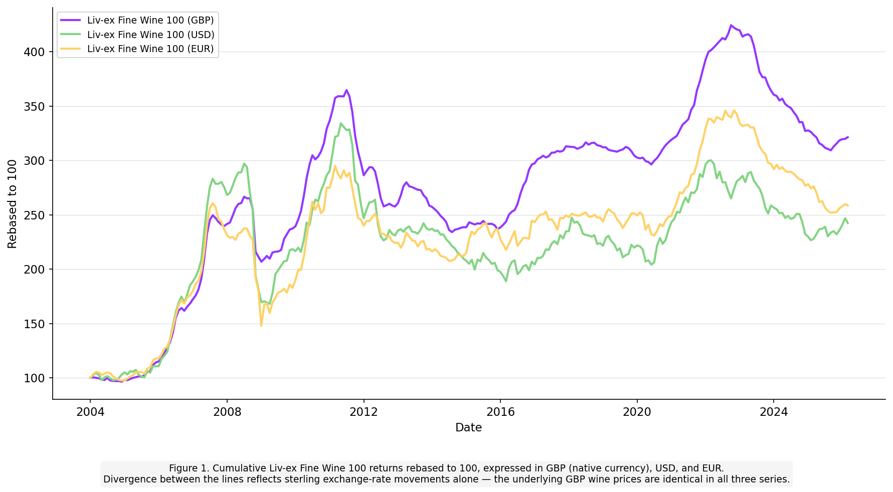

*Figure 8: Cumulative returns on a fine wine index expressed in GBP, EUR, and USD over a 20-year period. Sources: Liv-ex, WineFi analysis.*

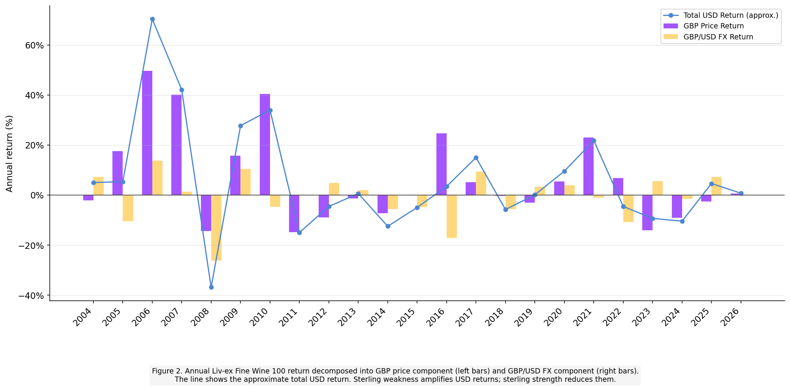

*Figure 9: Annual return decomposition — underlying wine price appreciation versus currency contribution, year by year. Sources: Liv-ex, WineFi analysis.*

This is a real feature of the asset class, and it deserves straightforward acknowledgement rather than obfuscation. Over two decades, the main fine wine index returned approximately 3.6x in sterling, approximately 3x in euros, and approximately 2.6x in US dollars. The currency of measurement materially affects the stated return.

Two points provide important context.

**First, this is not unique to fine wine.** Any internationally traded asset carries implicit currency exposure. A sterling-based investor allocating to US equities takes on dollar-sterling risk; a European investor in US technology stocks encountered exactly this dynamic when the dollar weakened in recent years. Currency exposure is not a feature peculiar to fine wine — it is a standard feature of international investing that investors manage through hedging, currency diversification, or explicit awareness of the exposure.

**Second, the currency dynamic can itself provide diversification.** Sterling weakness tends to coincide with periods of UK financial stress or political uncertainty. In such periods, an asset that appreciates in sterling terms — even partly due to currency effects — provides a useful hedge against the specific risks facing a UK-domiciled portfolio. This is analogous to holding gold, which also appreciates in local currency terms when that currency weakens.

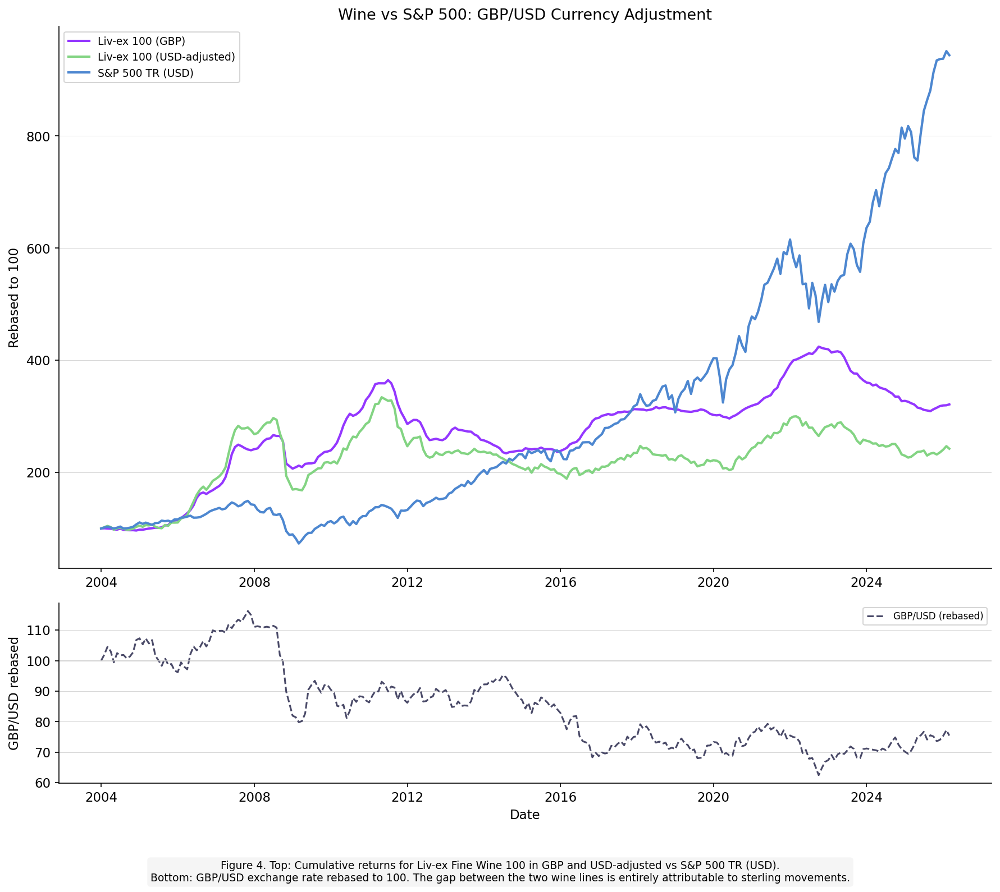

*Figure 10: Fine wine returns versus S&P 500 — both expressed on a currency-adjusted basis for GBP-based investors, across the 2008–2009 and 2020 stress periods. Sources: Liv-ex, Bloomberg, WineFi analysis.*

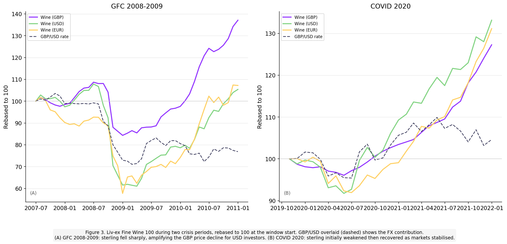

*Figure 11: Decomposition of fine wine returns during crisis periods into underlying price change and currency contribution. Sources: Liv-ex, WineFi analysis.*

The right approach is neither to dismiss currency effects nor to present sterling-denominated returns as if they were currency-neutral. Investors should understand the exposure, evaluate whether it aligns with their own currency situation, and factor it into their overall portfolio context. For many institutional investors in sterling or euro, the currency dimension of fine wine is manageable and, in some scenarios, genuinely additive.

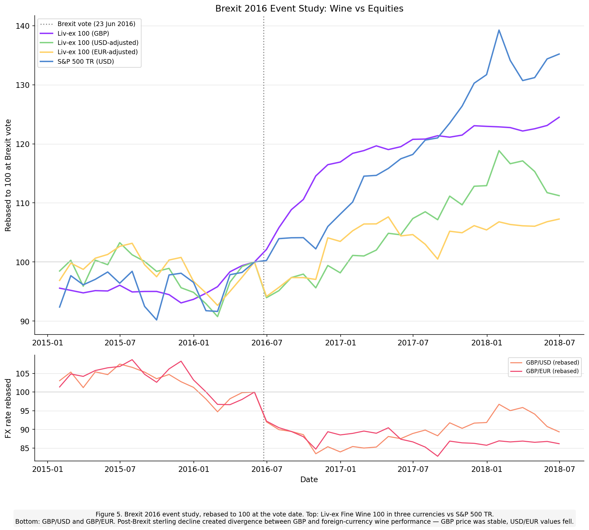

*Figure 12: Event study of the Brexit referendum — sterling depreciation and its impact on fine wine returns in different currencies. Sources: Liv-ex, Bloomberg, WineFi analysis.*

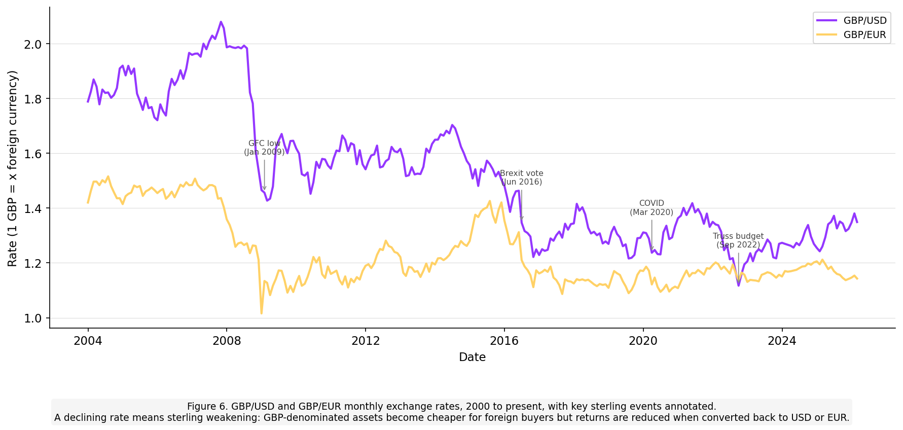

*Figure 13: Historical GBP/USD and GBP/EUR exchange rates, 2002–2025. Sources: Bloomberg.*

---

## Liquidity: Price Stability Is Not the Same as Liquidity

A separate concern is liquidity. Fine wine is not liquid in the conventional sense. There is no continuous two-way market; bid-offer spreads are meaningful; and the time required to execute a large sale at a full price can run to weeks or months. These are real constraints.

It is important, however, to distinguish between liquidity risk and price risk. An asset can be relatively illiquid and yet not subject to dramatic price collapse during a downturn. The fine wine market's behaviour during the 2008 financial crisis illustrates this: prices fell, but moderately and gradually — the illiquidity that slows trading in both directions also moderates the pace of price discovery on the downside.

For long-term investors with appropriate time horizons — those not reliant on fine wine as a source of emergency liquidity — the illiquidity premium may be a feature rather than a drawback. Academic evidence across alternative asset classes consistently shows that illiquid assets command a return premium over time, precisely because they require investors to commit capital for longer periods.[^1]

Fine wine is best understood as an asset appropriate for a portion of a portfolio that the investor is genuinely comfortable holding for a five-to-ten-year horizon. Within that context, the liquidity characteristics of the market are knowable and manageable. Treating fine wine as a source of near-term liquidity — or expecting to transact at market prices rapidly during a crisis — would be a misallocation of the asset.

---

## Geopolitical and Trade Policy Considerations

Fine wine is not immune to geopolitical risk. The imposition of tariffs on wine — whether by the United States, China, or other major markets — can directly affect demand flows and, over time, prices in the secondary market.

Historical examples include China's suspension of Australian wine imports from 2020 to 2023, which temporarily redirected demand and affected pricing for affected producers.[^2] More recently, proposed and enacted tariffs on European imports have introduced uncertainty for wines with significant North American exposure.

These risks are real and should inform portfolio construction. They are not, however, arguments against fine wine as a diversifier per se — they are arguments for diversification *within* fine wine. A portfolio overconcentrated in wines with high exposure to a single tariff-sensitive market will behave differently from one constructed with attention to the geographic distribution of buyers.

The structural characteristics that support diversification benefits — supply constraints, consumption dynamics, long-dated collector demand — are not eliminated by tariff cycles. They interact with geopolitical conditions, which introduces complexity, but does not fundamentally alter the long-run case.

---

## The Role of Data and Index Construction

The fine wine indices published by Liv-ex, the principal benchmark data provider, represent important but imperfect tools for evaluating the asset class. The indices are constructed from transacted prices on the Liv-ex exchange, supplemented by bid-offer mid-price quotations where transacted prices are unavailable. Different indices cover different wine populations — the Liv-ex 100 tracks the 100 most actively traded wines, while broader indices extend to several hundred or several thousand wines.

Index composition matters significantly. Indices weighted towards highly liquid, heavily traded wines — particularly leading Bordeaux châteaux — will exhibit higher correlation with mainstream financial assets than those incorporating less liquid, smaller-production wines. The Bordeaux 500 and the Burgundy 150 indices, for example, have shown historically different correlation profiles, reflecting the distinct buyer bases and supply dynamics of those regions.

This means that using any single index as a proxy for "fine wine as an asset class" involves a choice that materially affects conclusions about diversification. At WineFi, we construct and manage portfolios based on a global universe of investment-grade wines, using systematic analysis to identify wines where the balance of supply scarcity, demand breadth, and price relative to fundamental quality offers the strongest risk-adjusted return. The result is a portfolio that looks meaningfully different from any single published index, and whose diversification characteristics we believe are more favourable than those indices suggest.

---

## WineFi's Position: Disciplined Selection, Not Passive Exposure

The cumulative picture from this analysis leads to a clear conclusion, which we state plainly:

**Fine wine is not a guaranteed safe haven.** It is sensitive to macro conditions. Its prices can fall during severe financial stress. The diversification it provides is not automatic, frictionless, or perfectly reliable.

**Fine wine can be a valuable structural diversifier** for investors who approach it with appropriate rigour. The evidence across multiple market cycles shows:

- Low and time-varying correlation with equities and other conventional assets
- Shallower drawdowns during equity bear markets in several historical episodes
- Faster recovery than equities following several significant downturns
- Return drivers that are structurally distinct from those of financial markets
- Genuine internal heterogeneity, meaning that portfolio construction determines outcomes

The diversification case for fine wine is strongest when it is built on selection, not index exposure. Passive access to the fine wine market — simply buying a basket of whatever is most liquid — imports both the genuine characteristics of the asset class and its weaknesses. Active management, focused on identifying wines with the strongest fundamental scarcity, the most diversified global demand bases, and the most favourable entry prices, can capture the diversification benefits while managing the specific risks that the asset class presents.

At WineFi, this philosophy underpins every portfolio we construct. Our investment process is grounded in data — market price analysis, supply data, and demand signals — and focused on the portion of the fine wine universe that we believe offers the best risk-adjusted return characteristics. We are transparent about what fine wine is and what it is not. We believe that transparency, combined with disciplined selection, is the foundation of a durable case for the asset class in a well-constructed portfolio.

---

## References and Sources

[^1]: Ibbotson, R.G., Chen, P., Kim, D.Y.J., and Hu, W.Y. (2013). "Liquidity as an Investment Style." *Financial Analysts Journal*, 69(3), 30–44.

[^2]: Australian Government Department of Agriculture (2023). "China trade restrictions on Australian agricultural exports." agriculture.gov.au.

**Market data and indices:**
- Liv-ex (London International Vintners Exchange). *Liv-ex Fine Wine Indices: Methodology and Construction.* Available at: liv-ex.com
- Liv-ex (2012). *The Liv-ex Mid-Price*. Methodology note. Available at: liv-ex.com/wp-content/uploads/2012/10/midprice.pdf

**Academic and analytical background:**
- Masset, P., and Henderson, C. (2010). "Wine as an Alternative Asset Class." *Journal of Wine Economics*, 5(1), 87–118.
- Masset, P., and Weisskopf, J.-P. (2015). "Wine Indices in Practice: Nicely Labelled but Rough Inside?" *Quantitative Finance*, 15(3), 559–572.
- Sanning, L.W., Shaffer, S., and Sharratt, J.M. (2008). "Bordeaux Wine as a Financial Investment." *Journal of Wine Economics*, 3(1), 51–71.
- Fogarty, J.J. (2010). "Wine Investment and Portfolio Diversification Gains." *Journal of Wine Economics*, 5(1), 119–131.
- Krasker, W.S. (1979). "The Rate of Return to Storing Wines." *Journal of Political Economy*, 87(6), 1363–1367.

**Macroeconomic and financial market data:**
- S&P Dow Jones Indices. *S&P 500 historical price data.* spglobal.com
- FTSE Russell. *FTSE 100 Index data.* ftserussell.com
- Bloomberg L.P. *Equity index, gold, and currency price data series.*
- Bank of England. *UK historical exchange rate data.* bankofengland.co.uk

---

*This article is produced for information purposes only. It does not constitute investment advice. Past performance is not a guide to future returns. Fine wine investment involves risk, including possible loss of capital. WineFi is not regulated by the Financial Conduct Authority. Investors should seek independent financial advice before making investment decisions.*

*WineFi Research | winefi.com | March 2026*
