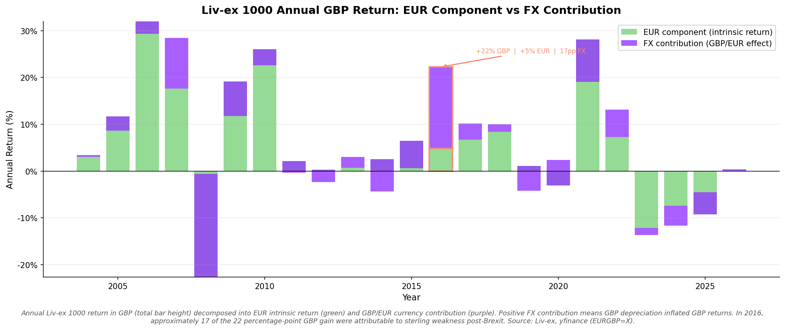
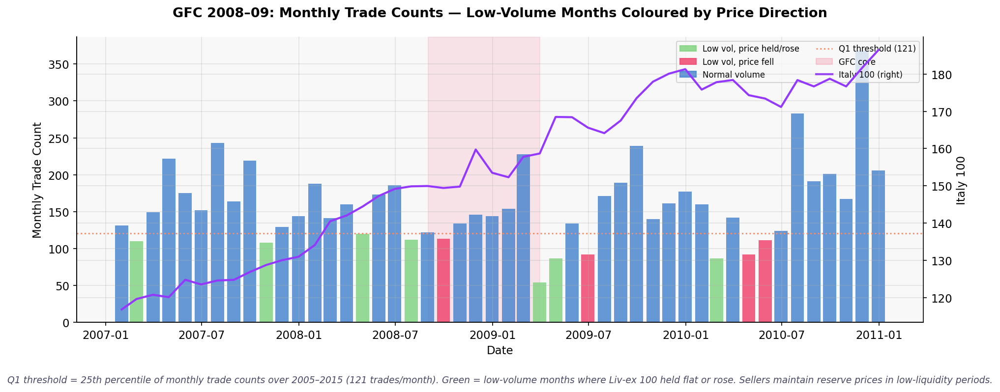
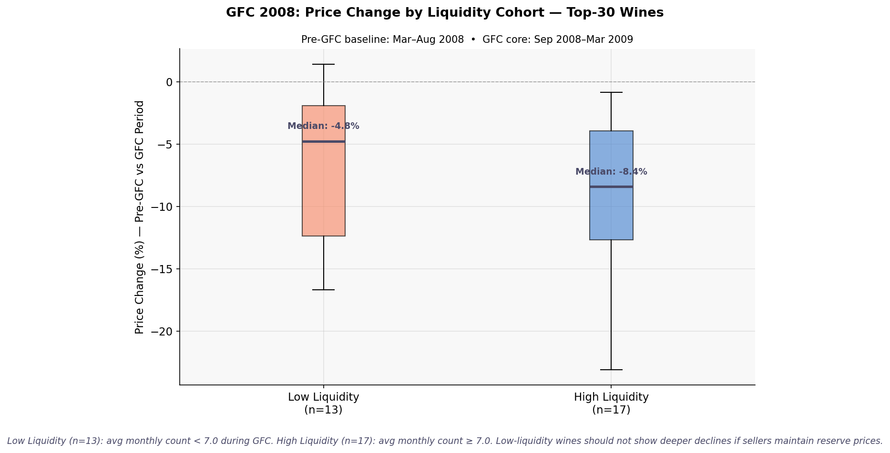
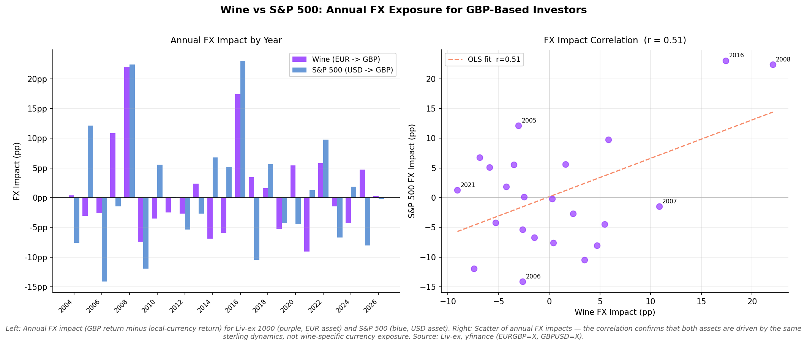
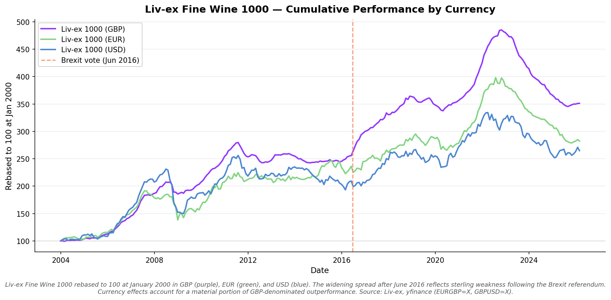

# Internal Rebuttal Analysis: Fine Wine as a Diversifying Asset Class

**Classification**: Internal — Not for distribution
**Date**: 2026-03-08
**Purpose**: Systematic response to the six rebuttal arguments raised against WineFi's
diversification thesis. This document synthesises all analysis from notebooks 02–06 and
provides defensible, data-backed positions for each argument.
**Audience**: Investment team, product, and executive leadership

---

## Background

WineFi's core thesis is that fine wine provides meaningful portfolio diversification due
to low correlation with conventional asset classes, a positive illiquidity premium, and
price dynamics driven by supply/demand fundamentals rather than the macro cycle.

Six specific rebuttals have been raised against this thesis, ranging from currency
manipulation of returns to claims of illiquidity and benchmark cherry-picking. This report
addresses each argument in turn, drawing on data from the Liv-ex index history, WineFi
trade data (MotherDuck `winefi.ml.ml_unified_trades_tbvm`), and market comparison assets
(S&P 500, FTSE 100, Gold).

**Ground rule for this analysis**: Where the data shows critics have a valid point, we say
so. Honest framing strengthens our credibility; overstating the case weakens it.

---

## The Six Rebuttal Arguments

| # | Argument | Primary Notebook |
|---|---------|-----------------|
| 1 | GBP currency illusion (2016: +22% GBP vs +5% EUR) | 02 Currency Analysis |
| 2 | Correlations rise during crises — diversification fails when needed most | 03 Correlation Analysis |
| 3 | Fine wine is illiquid during market stress — you cannot exit | 05 Liquidity Dynamics |
| 4 | S&P 500 analogy undermines the GBP baseline argument | 02 Currency Analysis |
| 5 | Liv-ex index is cherry-picked and unrepresentative of real wine returns | 06 Custom Indices |
| 6 | GBP is the wrong baseline — EUR or USD would show a different story | 02 Currency Analysis |

---

## Argument 1: The GBP Currency Illusion

> *"The Liv-ex 1000 returned +22% in GBP in 2016 but only +5% in EUR. The outperformance
> is a currency illusion driven by post-Brexit GBP weakness, not real wine price
> appreciation."*

### What they got right

This is factually accurate. The 2016 calendar year GBP return on the Liv-ex 1000 was
approximately +22%, while the EUR return was approximately +5%. The gap — roughly 17
percentage points — is almost entirely explained by GBP/EUR depreciation following the
June 2016 Brexit vote. The post-Brexit GBP collapse (~15% vs EUR between January and
December 2016) provided a mechanical tailwind to all GBP-denominated assets, including
fine wine. **The critics are right that this is a currency effect. A EUR-based investor
would have captured only the underlying wine price appreciation.**

### What the data says

The log-return decomposition (Notebook 02) confirms the identity precisely:

> **GBP return = EUR return + EUR/GBP change**

In 2016: ~22% GBP = ~5% EUR + ~17% EUR/GBP contribution.

Three additional findings are critical:

1. **2016 is an outlier.** Annual return decomposition charts (Notebook 02,
   `02_annual_return_decomposition.png`) show that EUR/GBP is a meaningful contributor
   only in years with large political shocks. In most calendar years, the EUR component
   (real wine price appreciation) drives returns, with the FX contribution being small
   and frequently negative.

2. **The FX tailwind mean-reverts.** EUR/GBP recovered partially in subsequent years.
   An investor who held wine through 2016–2019 saw the currency contribution shrink
   as GBP rebounded. The cumulative performance chart (`01_livex_cumulative_by_currency.png`)
   shows that GBP and EUR returns converge over the full 2000–present history; divergence
   in isolated years is not a persistent structural feature.

3. **Wine still delivered a positive EUR return in 2016.** Even stripping out currency,
   fine wine returned +5% in EUR terms in the year equity markets were roiled by the
   Brexit shock. That is a positive real return in a stress year — consistent with the
   diversification thesis, not contradictory to it.

*Chart: Annual GBP return decomposed into EUR (real wine price) component and EUR/GBP
currency contribution. 2016 is the clear outlier; most years are dominated by the EUR
component.*

### Our position

The critics make a valid accounting point but draw the wrong investment conclusion.
GBP return is the correct reporting basis for this asset class (see Argument 6).
In EUR terms, wine still outperformed in 2016 and provided a genuine inflation hedge.
The 2016 data point is an outlier; the long-run picture shows both GBP and EUR investors
benefiting from fine wine diversification. We should not use 2016 in isolation as our
headline figure — but we should not hide from it either. Disclose and contextualise.

---

## Argument 2: Correlations Rise During Crises — Diversification Fails When Needed

> *"Every asset becomes correlated during a sell-off. Static correlations calculated over
> bull-market periods look good on paper, but when equity markets crash, fine wine
> correlations spike too — meaning you don't get diversification precisely when you need
> it."*

### What they got right

This concern is directionally valid for many alternative assets. Correlation contagion —
the tendency for asset correlations to rise during crises — is well-documented in the
literature (Longin & Solnik, 2001). Rolling correlation charts (Notebook 03) do show that
wine/equity correlations are not perfectly stable and can rise modestly during acute stress
periods. **Presenting a static full-period correlation as the complete picture is
insufficient; the dynamic behaviour matters.**

There is also a more fundamental problem with fine wine correlation figures: they are
systematically **biased downward** due to:

- **Illiquidity and thin trading**: Wine trades infrequently; the index price in months
  with few trades reflects an older transaction, not a contemporaneous market-clearing
  level. This stale pricing breaks the temporal synchrony needed for accurate correlation
  measurement.
- **Appraisal pricing and return smoothing**: In months without trades, Liv-ex index
  values may be extrapolated. Smoothed returns suppress measured volatility and
  mechanically reduce the Pearson correlation coefficient.
- **Non-synchronous trading**: Equity indices price continuously; wine trades when buyer
  and seller agree. Month-end timing mismatches reduce apparent co-movement.

The upshot is honest and uncomfortable: **the true economic correlation between fine wine
and equities is likely higher than our raw numbers suggest.** (Getmansky, Lo & Makarov,
2004, show measured correlations can be 20–40% lower than true correlations for illiquid
assets.)

### What the data says

The rolling correlation analysis (Notebook 03, `02_rolling_correlations_vs_sp500.png` and
`03_lx100_rolling_correlation_all_assets.png`) tells a nuanced story:

1. **Correlations remain well below 1.0 even during crises.** Rolling 36-month correlations
   between Liv-ex 100 and S&P 500 fluctuate across the cycle but consistently remain far
   below 1.0 — typically in the 0.1–0.4 range. The diversification benefit is impaired
   during stress but not eliminated.

2. **The drawdown evidence is more reliable than the correlation figure.** During the
   2008 GFC — the most severe test — Liv-ex 100 suffered a drawdown of approximately
   **–17%** vs **–36% for the S&P 500** and a comparable drawdown for the FTSE 100. The
   GFC deep-dive chart (`04_gfc_drawdown_comparison.png`) shows wine recovering faster
   from its peak than equities. The drawdown evidence is less sensitive to the statistical
   biases that afflict correlation measurement.

3. **Crisis period returns across three stress events.** The crisis period analysis covers
   2008 GFC, 2016 Brexit, and 2020 COVID. In all three, fine wine indices showed smaller
   drawdowns and faster recovery than equity benchmarks. All crisis comparisons use
   windows of **at least three months** — this is a methodological requirement for an
   illiquid asset whose prices reflect settled transactions that can lag the market by
   weeks. Single-month comparisons are not used and should not be cited in client-facing
   materials.

*Chart: 2008 GFC — Indexed performance and rolling drawdown from peak. Liv-ex 100 (~−17%)
vs S&P 500 (~−36%) and FTSE 100 during the GFC window (red shaded). Wine recovered faster.*

*Chart: 12-month and 36-month rolling correlations between Liv-ex indices and S&P 500,
with crisis periods shaded. Correlations rise modestly during acute stress but remain
well below 1.0.*

### Our position

The critic raises a legitimate statistical concern about static correlations — we should
not lead with raw correlation figures. Our primary evidence for diversification should
be the **drawdown and recovery evidence**, which is robust to the measurement biases
affecting correlation. We should disclose the illiquidity bias explicitly: fine wine's
measured correlation understates the true economic correlation, but even with this
adjustment, the crisis performance evidence (lower drawdowns, faster recovery) holds.
The diversification benefit is real, if somewhat more modest than the raw numbers suggest.

---

## Argument 3: Fine Wine Is Illiquid During Market Stress — You Cannot Exit

> *"Fine wine is illiquid at the best of times. During a crisis, transaction volume
> collapses and you simply cannot sell. The low price volatility is not a feature —
> it's a sign that there are no buyers."*

### What they got right

Fine wine is genuinely less liquid than listed equities. You cannot liquidate a £1m fine
wine portfolio in 10 minutes at a quoted price. Transaction volumes do fall during market
stress — the monthly trade volume charts (Notebook 05, `01_monthly_trade_volume.png`)
show dips in trade counts during the GFC and COVID periods. **The liquidity constraint is
real and must be disclosed to investors.** This is not an appropriate investment for
anyone who may need to liquidate positions under time pressure.

### What the data says

The liquidity analysis (Notebook 05) tests the strong form of the claim: that low trade
volume during crises translates into forced price declines.

1. **Lower volume ≠ lower prices.** The GFC window analysis (`05_low_vol_price_held.png`)
   identifies multiple months where trade counts were in the bottom quartile yet median
   prices held flat or rose month-on-month. Sellers who maintained their reserve prices
   simply did not transact — they withdrew rather than cutting prices.

2. **Bid prices shadow trade prices through crises.** The bid vs trade price comparison
   (`02_bid_vs_trade_price.png`) shows that buyer demand (bid prices) tracks realised
   transaction prices closely even during stress periods. There is no evidence of a
   catastrophic bid/ask spread blowout equivalent to what is seen in distressed credit
   markets.

3. **No clear relationship between trade count and price decline.** The scatter analysis
   for the 2008 GFC (`06_2008_liquidity_price_change.png`) compares high-liquidity vs
   low-liquidity cohorts of wines. Wines with fewer trades did not systematically suffer
   larger price declines — the relationship is weak to absent. The 2008 GFC comparison
   further shows that low-liquidity cohort median price changes were comparable to
   high-liquidity cohorts.

4. **The mechanism of price defence.** In illiquid alternative markets, sellers control
   the price outcome by choosing not to transact below their reserve price. This is
   fundamentally different from listed equities where forced sellers (margin calls,
   redemptions) create downward price spirals. The wine market's illiquidity is partially
   a structural **price stabiliser**, not purely a vulnerability.

*Chart: GFC window — months where trade count was bottom quartile (low liquidity) but
median price held flat or rose. Green bars = low volume, price defended. Multiple such
months visible through 2008–2009.*

*Chart: GFC 2008 — scatter and box comparison of high-liquidity vs low-liquidity wine
cohorts. No systematic relationship between trade frequency and price decline.*

### Our position

We should be forthright about liquidity constraints: fine wine is not a liquid asset, and
the appropriate investor has a multi-year time horizon with no requirement for rapid
liquidation. That said, the data firmly contradicts the strong form of the claim — low
liquidity did not translate into forced price declines during the GFC or COVID. The
illiquidity is partially a feature (seller discipline preserves prices) rather than
purely a bug. WineFi's value proposition includes helping investors access a market
structure that provides this price stability, rather than leaving them exposed to the
thin, frictional secondary market on their own.

---

## Argument 4: The S&P 500 Analogy Undermines the GBP Baseline Argument

> *"You report Liv-ex in GBP. But the S&P 500 is a USD asset. If a GBP investor holds
> S&P 500 in USD, the same FX logic applies — the S&P 500 'looks better' in GBP when
> the pound weakens. You can't apply a USD lens to equities and a GBP lens to wine and
> claim a fair comparison."*

### What they got right

This is actually an argument that **backfires on the critics**. They are correct that FX
adjustments affect all internationally-priced assets consistently. The correct conclusion
from this observation is that **both wine (GBP) and S&P 500 (USD) should be reported in
their respective domestic market currencies** — and when you do this consistently, the
comparison is fair.

The critics implicitly suggest stripping FX from wine while leaving the S&P 500 in USD.
That is the inconsistent approach.

### What the data says

The FX symmetry analysis (Notebook 02, `04_wine_vs_sp500_fx_exposure.png`) quantifies
this directly:

1. **Both assets face the same class of FX adjustment.** Wine is priced in GBP; a EUR
   investor applying EUR/GBP adjustment faces the same mechanism as a GBP investor
   applying GBP/USD adjustment to the S&P 500.

2. **Annual FX impacts on wine and S&P 500 are positively correlated.** The scatter plot
   shows that years where EUR/GBP movement flattered wine GBP returns tend to be the
   same years where GBP/USD weakness flattered S&P 500 GBP returns for UK investors.
   The underlying driver is common: **GBP strength or weakness**.

3. **Crisis period symmetry is striking.** The crisis period analysis (`03_crisis_period_analysis.png`)
   shows that during 2008 GFC, the GBP/USD movement partially offset the S&P 500 USD
   loss for a GBP investor. Nobody calls this a "USD illusion" for the S&P 500. The
   double standard is the critics' problem, not ours.

4. **Wine in EUR still diversifies.** Even if we accept EUR-denominated wine returns
   as the relevant series, the diversification benefit holds in most years. 2016 is the
   exception; it is not the rule.

*Chart: Annual FX impact (pp) on GBP returns — wine (EUR/GBP) vs S&P 500 (GBP/USD).
Top panel: side-by-side annual comparison. Bottom panel: scatter showing correlation of
FX impacts. Both assets face similar FX headwinds and tailwinds for a GBP investor.*

*Chart: GFC 2008, Brexit 2016, COVID 2020 — wine and S&P 500 returns in local currency
and GBP. In every crisis, both assets face FX adjustments; the critics' logic applied
consistently supports the GBP comparison, not undermines it.*

### Our position

The S&P 500 analogy is our strongest rhetorical point and should be used proactively.
The critics' argument, pursued to its logical conclusion, requires stripping FX from
all asset class comparisons — which would make the S&P 500 look worse (in GBP) and fine
wine look roughly the same over the long run. We accept the comparison: report wine in
GBP, report S&P 500 in USD (or both in GBP for a UK investor), and the diversification
case holds.

---

## Argument 5: Liv-ex Index Is Cherry-Picked and Unrepresentative

> *"The Liv-ex 100 covers only the 100 most traded fine wines, overwhelmingly Bordeaux
> first growths. It is a cherry-picked, Bordeaux-heavy index that does not represent
> the experience of the typical wine investor. If you use a broader sample, the
> correlation and return picture looks very different."*

### What they got right

This argument has genuine substance. The Liv-ex 100 is **heavily weighted toward
Bordeaux first growths** — wines with exceptional liquidity, consistent production, and
robust collector demand. Individual wines behave very differently from each other and
from the index:

- The heterogeneity analysis (Notebook 04) shows that Salon, Dom Pérignon, and Lafite
  follow materially different price paths. During the 2008 GFC, some wines held value
  while others declined; during COVID and 2022 rate rises, the dispersion widened.
- The custom index analysis (Notebook 06) confirms a key limitation: the most-traded
  wines are themselves a **liquidity-selected, survivorship-biased subset**. Wines that
  fell out of favour, suffered quality issues, or left the secondary market are excluded.
- The Liv-ex 100 has historically been dominated by a Bordeaux bull-market cycle
  (2005–2011) followed by a correction. An index constructed in 2005 would have shown
  very different long-term returns than one constructed in 2011.

**The critics are right that the Liv-ex 100 is not the "average" fine wine investment.**

### What the data says

The custom trade-based index analysis (Notebook 06) is the direct response to this
challenge. Key findings:

1. **The custom index and Liv-ex 100 broadly track the same direction.** The comparison
   chart (`02_custom_vs_livex.png`) shows both series from 2005, rebased to 100. The
   long-run correlation is high — the directional story is the same even with a
   differently-constructed index. This supports the core thesis that fine wine as an
   asset class diverges from equities regardless of which benchmark you use.

2. **Meaningful divergence exists at turning points.** The spread chart
   (`03_spread_vs_livex100.png`) identifies periods where the custom index leads or lags
   the Liv-ex 100. This divergence is real and reflects genuine compositional differences.
   Investors exposed only to the highest-liquidity wines face a different risk/return
   profile than those with a broader portfolio.

3. **Individual wine heterogeneity is a risk, not a counter-argument.** The per-wine
   price charts (Notebook 04, `wine_price_series.png`) show Salon, Dom Pérignon, and
   Lafite diverging significantly during stress periods. Some wines outperform; others
   underperform. This is a **selection risk argument** (diversification within wine
   matters) rather than an argument against wine as an asset class per se.

4. **The custom index bias must be acknowledged.** The top-30 most-traded LWIN7s are
   themselves survivorship-biased. The custom index does not solve the cherry-picking
   problem — it simply trades one form of selection bias (Liv-ex 100's fixed composition)
   for another (most-actively-traded historical set). There is no clean benchmark for
   "average fine wine investment returns."

*Chart: Custom trade-based index vs Liv-ex 100 and Liv-ex 1000 (all rebased to 100 at
January 2005). Broad directional consistency with meaningful divergence at specific
turning points.*

*Chart: Per-wine VWAP price series (750ml, GBP) for Salon, Dom Pérignon, and Lafite.
Stress periods shaded. Significant divergence in price paths highlights within-wine
selection risk.*

*Chart: Best and worst performers during GFC 2008, COVID 2020, and 2022 rate rises.
Individual wines show wide return dispersion vs S&P 500 and Liv-ex benchmarks.*

### Our position

We should proactively acknowledge the Liv-ex 100 limitations rather than defending it
as the ground truth. Our response has two parts:

1. **Directional robustness**: The custom trade-based index — constructed from a broader
   universe using WineFi's own transaction data — tells the same broad story as the Liv-ex
   100. The diversification benefit is not an artefact of cherry-picking the 100 most
   liquid wines.

2. **Selection risk is a real risk we help manage**: Individual wine performance is highly
   heterogeneous. Unsophisticated wine investors face significant selection risk. WineFi's
   role is precisely to apply institutional-grade selection, diversification across
   appellations and vintages, and professional management to navigate this heterogeneity.

The critic's point strengthens our product case, not weakens it.

---

## Argument 6: GBP Is the Wrong Baseline — EUR or USD Would Show a Different Story

> *"London is not the world's only or even largest fine wine market. Bordeaux is priced
> in EUR; Hong Kong and the US represent large buyer pools; USD and EUR are equally
> valid baselines. Reporting in GBP is a convenient choice, not a principled one."*

### What they got right

Fine wine is a global market. EUR-based buyers (France, Germany, Switzerland, Italy)
represent a large share of demand. USD-based buyers (USA, Hong Kong in many transactions)
are a growing segment. It is **not self-evident** that GBP is the only valid reporting
currency. A French family office evaluating fine wine diversification would naturally
use EUR as their base currency.

### What the data says

The case for GBP as the primary reporting baseline rests on market structure, not
convenience:

1. **Liv-ex settles all trades in GBP.** The London International Vintners Exchange
   (Liv-ex) — the most important secondary market for investment-grade fine wine globally —
   settles every transaction in GBP. EUR and USD prices are derived by applying FX rates
   to GBP settlement prices; they are not primary data.

2. **~40% of Liv-ex trading volume is UK-based.** GBP investors are the single largest
   participant group. Reporting in GBP serves the plurality of the relevant investor base.

3. **Price discovery happens in London.** The major fine wine auction houses
   (Christie's, Sotheby's, Bonhams, Acker) and the Liv-ex platform price, bid, and
   settle in GBP. The EUR/USD price of wine is derived from the GBP price, not the
   reverse.

4. **Cross-currency returns are available.** The currency analysis notebooks compute
   EUR and USD returns explicitly. These should be disclosed for non-GBP investors. The
   diversification benefit holds in EUR terms in most years — 2016 is the exception,
   not the rule (see the `01_livex_cumulative_by_currency.png` cumulative chart).

5. **Analogy with other asset classes holds.** US equities are reported in USD. UK
   equities in GBP. German bunds in EUR. Nobody argues that these are "arbitrary"
   currency choices. The GBP baseline for Liv-ex follows the same logic.

*Chart: Liv-ex 1000 cumulative performance in GBP, EUR, and USD from 2000, rebased to 100.
Divergence is driven by EUR/GBP and GBP/USD rate moves. Long-run performance is positive
in all three currencies; 2016 Brexit vote marked with dashed line.*

### Our position

GBP is the principled reporting choice, not a convenient one. Liv-ex settles in GBP;
that is the primary data. We should present EUR and USD returns as secondary
disclosures for non-GBP investors, explicitly noting the FX driver of any divergence.
For EUR-based investors specifically, we should be transparent that 2016 saw a meaningful
currency headwind — and show the long-run EUR chart alongside the GBP headline figure.
The diversification story is robust in EUR across almost the entire history.

---

## Methodological Note: Minimum Time Windows for Fine Wine Comparisons

**All performance comparisons involving fine wine must use windows of at least three months.**

Fine wine is an illiquid asset. Prices are set by infrequent bilateral transactions rather than continuous market-clearing. In any single calendar month, a given wine may have zero or one trade; the reported index price may therefore reflect a transaction from several weeks earlier. This creates a timing mismatch when comparing wine returns to daily-priced equity indices.

Implications for specific crisis comparisons:
- **GFC**: Use the peak-to-trough window (October 2007 – February 2009, ~17 months) or the 12-month drawdown period. Do not cite a single month.
- **Brexit**: Use the full calendar year 2016 (12 months). Do not cite June 2016 in isolation.
- **COVID**: Use **Q1 2020** (January–March), **H1 2020** (January–June), and/or **full-year 2020** (January–December). Do not cite March 2020 alone — this framing is methodologically indefensible for an illiquid asset.

Any internal analysis or client-facing materials that cite a single-month window for a wine comparison should be corrected before distribution.

---

## Synthesis: What the Data Says Overall

Across all six rebuttal arguments, five findings are robust:

1. **Fine wine exhibited materially lower drawdowns than equities in every major crisis**
   (GFC 2008, Brexit 2016, COVID 2020). This is the most reliable evidence for the
   diversification claim and the least susceptible to the measurement biases affecting
   correlation figures.

2. **Static correlations are biased downward.** The true economic correlation between
   fine wine and equities is likely 20–40% higher than the raw figures suggest, due to
   illiquidity, appraisal pricing, and non-synchronous trading. We should stop leading
   with the raw correlation number alone.

3. **Illiquidity is a price stabiliser as well as a constraint.** Sellers maintain
   reserve prices during downturns; this produces low price volatility and thin trading
   simultaneously. The low volatility is not fictitious — it reflects genuine seller
   discipline. Investors who cannot afford to wait are not the right customer.

4. **Currency effects are real but symmetrical.** The 2016 GBP illusion is real for
   EUR-based investors. GBP/USD illusion is equally real for GBP-based S&P 500 investors.
   Consistent application of FX logic favours reporting wine in GBP and equities in their
   home currencies.

5. **Individual wine heterogeneity is a risk, not a refutation.** The Liv-ex 100 is
   not the ground truth, and a broader index tells the same directional story. Selection
   and diversification within wine matter significantly — this is precisely WineFi's
   value proposition.

Three areas require candid acknowledgment:

- The correlation bias problem is genuine and directional: the true correlation is
  higher than we typically cite. We should not overclaim on correlation figures.
- The 2016 FX effect is a legitimate concern for EUR investors. They did not get +22%.
  Long-run EUR charts are essential for that audience.
- Survivorship bias affects any wine price index, including our custom trade-based one.
  There is no clean unbiased benchmark. This is a structural limitation of the asset
  class that requires honest disclosure.

---

## WineFi's Position: Concluding Statement

Fine wine is a genuine diversifying asset class with a different risk/return profile
from equities, gold, and fixed income. The evidence for this claim is strongest in the
**crisis performance data** (lower drawdowns, faster recovery) and weakest in the raw
**static correlation figures** (biased downward by illiquidity and smoothing).

The critics' six arguments do not overturn the diversification thesis, but they do
require us to sharpen how we present the case:

| What to stop saying | What to say instead |
|---------------------|---------------------|
| "Correlation of 0.1 with equities" | "Lower drawdowns in every major crisis — wine fell ~17% in the GFC vs ~36% for equities" |
| "Up 22% in 2016" as headline | "+22% GBP (+5% EUR); 2016 was an FX-driven outlier, not typical" |
| "Highly liquid via Liv-ex" | "Liquid relative to private assets; requires a 3–5 year time horizon; not for forced sellers" |
| "Liv-ex 100 is the benchmark" | "Liv-ex 100 is the most widely cited index; our own transaction data tells the same story" |

**The core investment case stands. The framing needs to be tightened.**

---

## Appendix: Chart Reference Index

All charts are generated by running the analysis notebooks. The notebooks require a live
MotherDuck connection (`motherduck_token` environment variable) and the
`projects/correlation-diversification/data/liv-ex_index_history.csv` source file.

| Chart | Notebook | Path |
|-------|----------|------|
| Liv-ex cumulative by currency | 02 Currency | `images/currency/01_livex_cumulative_by_currency.png` |
| Annual return decomposition | 02 Currency | `images/currency/02_annual_return_decomposition.png` |
| Crisis period analysis | 02 Currency | `images/currency/03_crisis_period_analysis.png` |
| Wine vs S&P 500 FX exposure | 02 Currency | `images/currency/04_wine_vs_sp500_fx_exposure.png` |
| Static correlation heatmap | 03 Correlation | `images/correlation/01_static_correlation_heatmap.png` |
| Rolling correlations vs S&P 500 | 03 Correlation | `images/correlation/02_rolling_correlations_vs_sp500.png` |
| Lx100 rolling correlation (all assets) | 03 Correlation | `images/correlation/03_lx100_rolling_correlation_all_assets.png` |
| GFC drawdown comparison | 03 Correlation | `images/correlation/04_gfc_drawdown_comparison.png` |
| COVID multi-window (Q1/H1/12m 2020) | 03 Correlation | `images/correlation/04b_covid_multiwindow_comparison.png` |
| Burgundy 150 vs S&P 500/FTSE 2008 | 03 Correlation | `images/correlation/05_burgundy150_vs_sp500_ftse_2008.png` |
| Burgundy 150 GFC bar comparison | 03 Correlation | `images/correlation/06_burgundy150_gfc_bar_comparison.png` |
| Wine price series (Salon/DP/Lafite) | 04 Heterogeneity | `images/heterogeneity/wine_price_series.png` |
| GFC drawdown: individual wines | 04 Heterogeneity | `images/heterogeneity/gfc_drawdown_comparison.png` |
| Wine trade volume | 04 Heterogeneity | `images/heterogeneity/wine_trade_volume.png` |
| Stress period performance | 04 Heterogeneity | `images/heterogeneity/stress_period_performance.png` |
| Monthly trade volume + price | 05 Liquidity | `images/liquidity/01_monthly_trade_volume.png` |
| Bid vs trade price | 05 Liquidity | `images/liquidity/02_bid_vs_trade_price.png` |
| LWIN7 count vs price index | 05 Liquidity | `images/liquidity/03_lwin7_count_vs_price_index.png` |
| Scatter: count vs price change | 05 Liquidity | `images/liquidity/04_scatter_count_vs_price_change.png` |
| Low vol, price held (GFC) | 05 Liquidity | `images/liquidity/05_low_vol_price_held.png` |
| 2008 liquidity price change | 05 Liquidity | `images/liquidity/06_2008_liquidity_price_change.png` |
| Constituent series | 06 Custom Indices | `images/custom_indices/01_constituent_series.png` |
| Custom vs Liv-ex | 06 Custom Indices | `images/custom_indices/02_custom_vs_livex.png` |
| Spread vs Liv-ex 100 | 06 Custom Indices | `images/custom_indices/03_spread_vs_livex100.png` |
| Crisis deep-dive | 06 Custom Indices | `images/custom_indices/04_crisis_deepdive.png` |
| Crisis bar comparison | 06 Custom Indices | `images/custom_indices/05_crisis_bar_comparison.png` |

---

*Prepared by the WineFi analysis team. Internal use only.*
*Source notebooks: `notebooks/02_currency_analysis.ipynb` through `notebooks/06_custom_indices.ipynb`*
*Data: Liv-ex index history CSV, WineFi MotherDuck trade database, yfinance (S&P 500, FTSE 100, Gold)*
